# Augmentation for Offline Data
****
<link rel="stylesheet" href="https://cdnjs.cloudflare.com/ajax/libs/font-awesome/6.1.0/css/all.min.css">

## 2023/4/24 更新
#### 修复bug，完善代码，现在前景图片在粘贴到背景图上时会自动缩放，同时所带的标注文件也会自动缩放（只支持yolo格式），不需要手动修改标注文件了。通过scale_range和max_output_size控制缩放大小。
```python
# 若前景图片带标注文件，则将input_foreground_annotation_path设置为前景图片所带的标注文件路径
"""
repeat_range: 前景图片粘贴次数范围
class_name: 前景图片类别名称
show_bbox_on_image: 是否在图片上显示前景图片的bbox
max_overlap: 前景图片与背景图片的最大重叠比例
input_annotation_path: 背景图片所带的标注文件路径
input_foreground_annotation_path: 前景图片所带的标注文件路径
scale_range: 前景图片缩放比例范围
max_output_size: 前景图片最大尺寸
"""
image_blender = ImageBlender(foreground_dir, background_dir, output_image_path, output_annotation_path,
                             repeat_range=(2,4), class_name='smoke', show_bbox_on_image=False, 
                             max_overlap=0.00, input_annotation_path=None, 
                             input_foreground_annotation_path=input_foreground_annotation_path,
                             scale_range=(0.5, 1.0), max_output_size=(200, 200))
```
## 2023/4/23 更新
#### 增加新功能：可以输入前景图片的标注文件，对前景图片进行增强，并把前景粘贴到背景图片上，生成新的图片和标注文件。
```python
foreground_dir = r"D:\Re_ID\dataset\Augment\test_paste_augment\foreground"
background_dir = r"D:\Re_ID\dataset\Augment\test_paste_augment\background"
# 前景图片所带的标注文件
input_foreground_annotation_path = r"D:\Re_ID\dataset\Augment\test_paste_augment\foreground_annotations"
# 背景图片所带的标注文件
input_annotation_path = r"D:\Re_ID\dataset\Augment\test_paste_augment\input_annotations"
output_image_path = r"D:\Re_ID\dataset\Augment\test_paste_augment\output_images"
output_annotation_path = r"D:\Re_ID\dataset\Augment\test_paste_augment\output_annotations"

image_blender = ImageBlender(foreground_dir, background_dir, output_image_path, output_annotation_path,
                             repeat_range=(1,3), class_name='smoke', show_bbox_on_image=True, 
                             max_overlap=0.05, input_foreground_annotation_path=input_foreground_annotation_path)
```

## 🔥项目简介
#### **该项目整合了一些常用的图像数据增强方法，主要用于目标检测任务**
<div style="display: flex; justify-content: space-between; width: 100%;">
    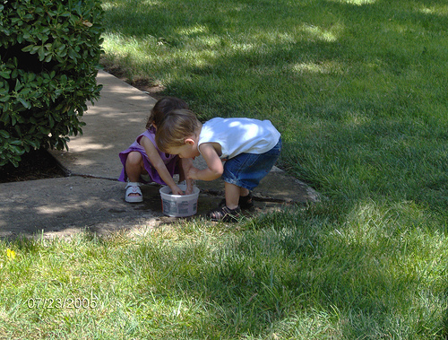
    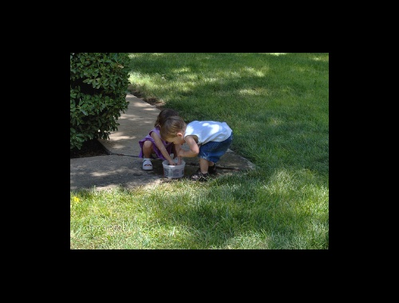
    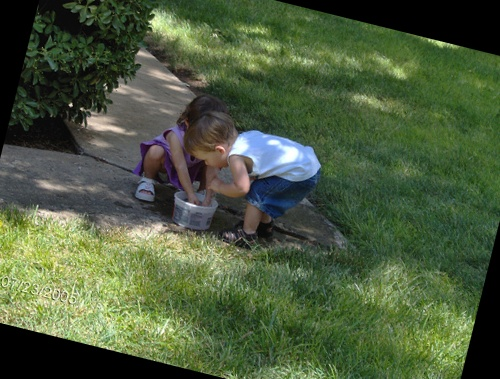
    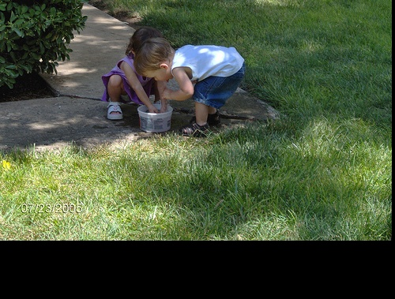
</div>

<div style="display: flex; justify-content: space-between; width: 100%;">
    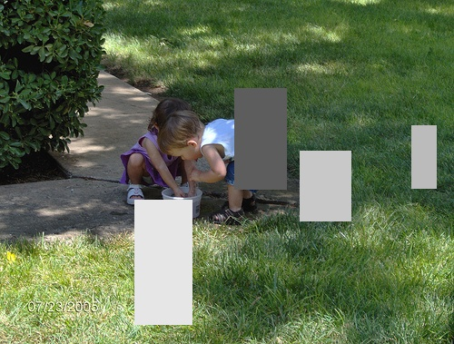
    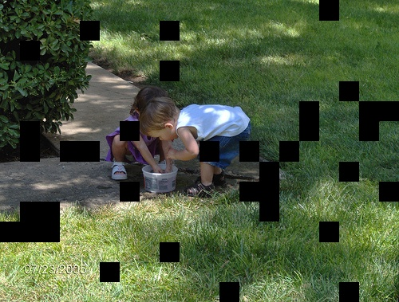
    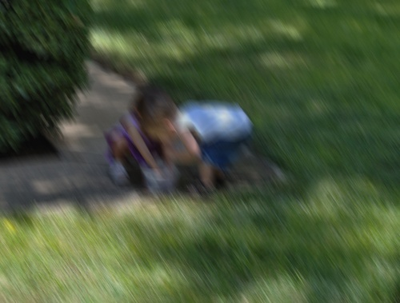
    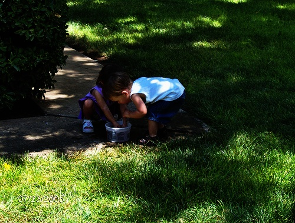
</div>

<div style="display: flex; justify-content: space-between; width: 100%;">
    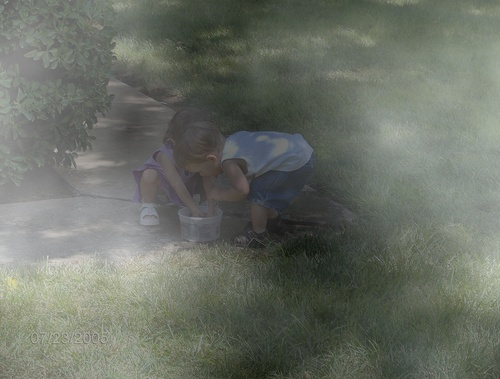
    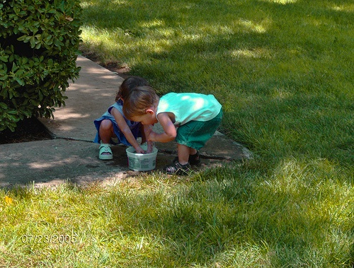
    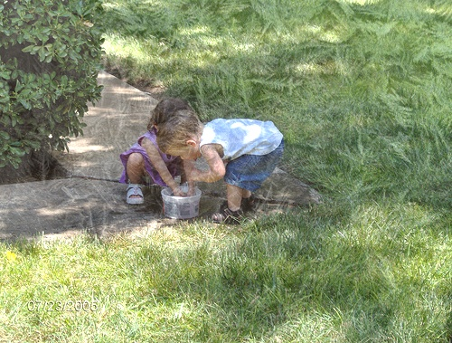
    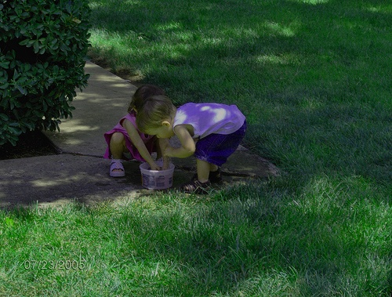
</div>

<div style="display: flex; justify-content: space-between; width: 100%;">
    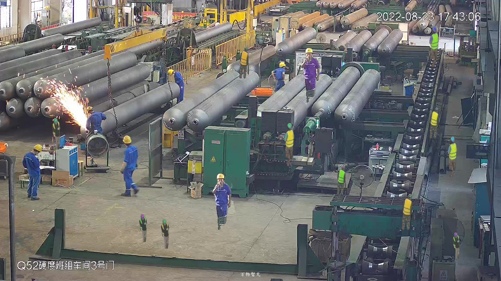
    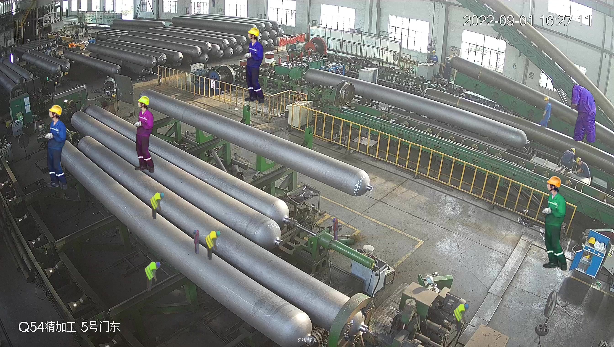
    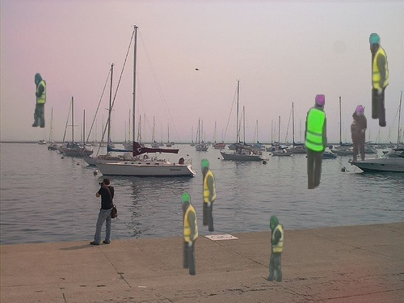
    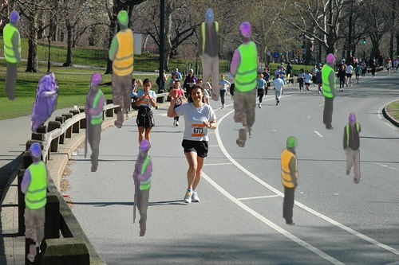
</div>

## 🛠️ Installation

#### 所需安装的Python包:
- `os`
- `opencv-python`
- `random`
- `numpy`
- `warnings`
- `xml`
- `math`
- `matplotlib`
- `numbers`
- `sys`
- `functools`
- `scipy`
- `imagecorruptions`

## 🏃 应用图像增强

#### 目前有两种图像增强方式，一种是对整张图片进行增强，另一种是对前景图片进行增强，并把前景粘贴到背景图片上。

```python
# 运行
python Augment.py
```

#### 🔳对整张图片进行增强
```python
# 图片输入路径
input_image_folder = r'D:\Re_ID\dataset\Augment\trans\input_image'
# 图片标注文件输入路径
input_annotation_folder = r'D:\Re_ID\dataset\Augment\trans\input_annotation'
# 图片输出路径
output_image_folder = r'D:\Re_ID\dataset\Augment\trans\output_image'
# 图片标注文件输出路径
output_annotation_folder = r'D:\Re_ID\dataset\Augment\trans\output_annotation'

# 实例化图像增强方法
random_scale = RandomScale(scale_range=(0.5, 1.5), fixed_aspect_ratio=False, annotation_type='voc')
random_trans = RandomTranslate(x_range=(-0.2, 0.2), y_range=(-0.2, 0.2), annotation_type='voc')
...

# 使用add_augmentations()方法添加增强方法
batch_augmenter.add_augmentations(random_scale.augment)
batch_augmenter.add_augmentations(random_trans.augment)
...

# 使用process()方法进行图像增强
batch_augmenter.process(input_image_folder, input_annotation_folder, output_image_folder, output_annotation_folder)
```

#### 🔲对前景图片进行增强，并把前景粘贴到背景图片上
```python
# 前景图片路径
foreground_dir = r"D:\Re_ID\projects\General purpose\foreground"
# 背景图片路径
background_dir = r"D:\Re_ID\projects\shanxi\JPEGImages"
# 图片标注文件输入路径
input_annotation_path = r"D:\Re_ID\projects\shanxi\Annotations"
# 图片输出路径
output_image_path = r"D:\Re_ID\projects\shanxi\output_images"
# 图片标注文件输出路径
output_annotation_path = r"D:\Re_ID\projects\shanxi\output_annotations"

# 图片增强
image_blender = ImageBlender(foreground_dir, background_dir, output_image_path, output_annotation_path,
                             repeat_range=(1,3), class_name='person', show_bbox_on_image=False, 
                             max_overlap=0.05, input_annotation_path=input_annotation_path)

"""
repeat_range: 前景粘贴的次数范围
class_name: 前景的目标类别
show_bbox_on_image: 是否在图片上显示目标框
max_overlap: 前景图片之间的最大重叠率
input_annotation_path: 图片标注文件输入路径, 如果不需要对图片进行标注，可以不输入
"""
# 使用add_augmentations()方法添加增强方法
image_blender.add_augmentations(random_rotate_image, angle_range=(-45, 45))
image_blender.add_augmentations(flip_image, flip_type='random', percentage=1)
image_blender.add_augmentations(add_gaussian_noise, scale=0.2*255, per_channel=True)
...

# 图片增强
# 注意:该方法会随机选择前景文件夹下的3-6张前景图片，然后把它们粘贴到背景图片上，再对粘贴后的图片进行增强
image_blender.blend_images()
```

## 💡内置的图像增强方法（同时适用于整张图片和前景图片）
#### 🔵随机缩放
```python
RandomScale(scale_range=(0.5, 1.5), fixed_aspect_ratio=False, annotation_type='voc')
"""
scale_range: 缩放比例范围
fixed_aspect_ratio: 是否保持长宽比
annotation_type: 标注文件类型，目前支持voc和yolo
"""
```
<div style="display: flex; justify-content: center; width: 100%;">
    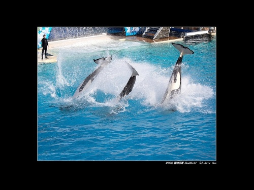
    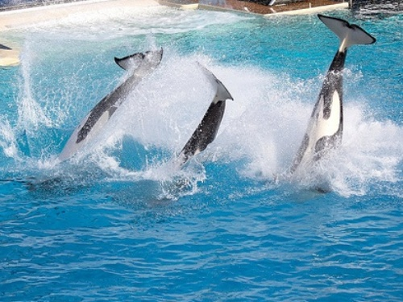
</div>

#### 🔵随机平移
```python
RandomTranslate(x_range=(-0.2, 0.2), y_range=(-0.2, 0.2), annotation_type='voc')
"""
x_range: x轴平移范围
y_range: y轴平移范围
annotation_type: 标注文件类型，目前支持voc和yolo
"""
```
<div style="display: flex; justify-content: center; width: 100%;">
    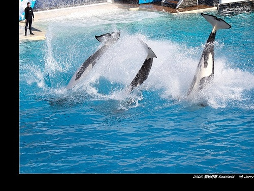
    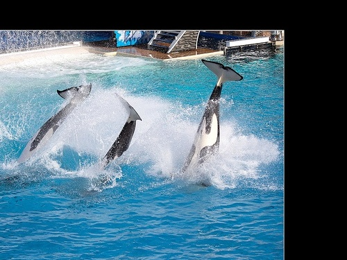
</div>

#### 🔵随机上下翻转
```python
ImageFlipper(percentage=1, annotation_type='voc')
"""
percentage: 翻转概率
annotation_type: 标注文件类型，目前支持voc和yolo
"""
```
<div style="display: flex; justify-content: center; width: 100%;">
    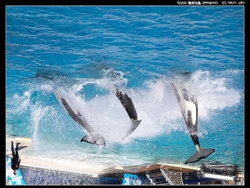
    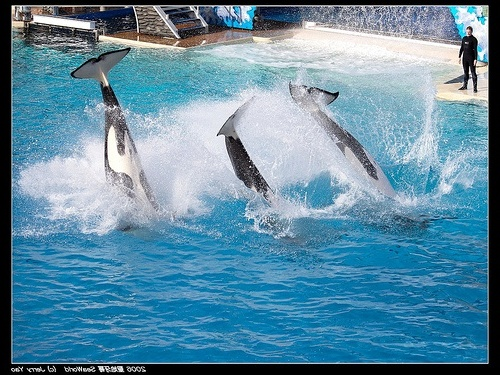
</div>

#### 🔵随机上下翻转
```python
RandomRotate(angle_range=(-45, 45), annotation_type='voc')
"""
angle_range: 旋转角度范围
annotation_type: 标注文件类型，目前支持voc和yolo
"""
```
<div style="display: flex; justify-content: center; width: 100%;">
    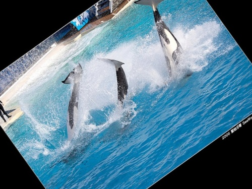
    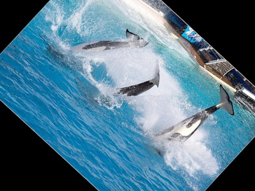
</div>

#### 🔵随机添加高斯噪声
```python
gaussian_noise(scale=0.2*255, per_channel=True)
"""
scale: 噪声的标准差
per_channel: 是否对每个通道添加噪声
"""
```
<div style="display: flex; justify-content: center; width: 100%;">
    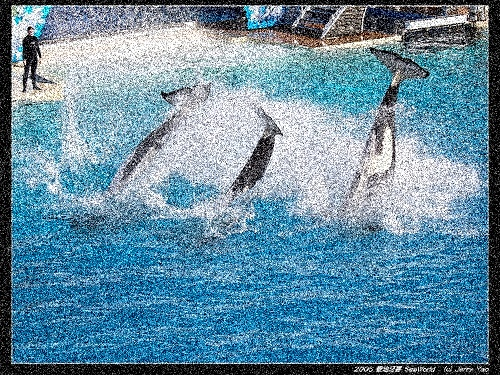
    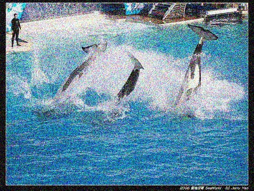
</div>

#### 🔵随机亮度处理
```python
process_brightness(lower=0.5, upper=1.5)
"""
lower: 亮度下限
upper: 亮度上限
"""
```
<div style="display: flex; justify-content: center; width: 100%;">
    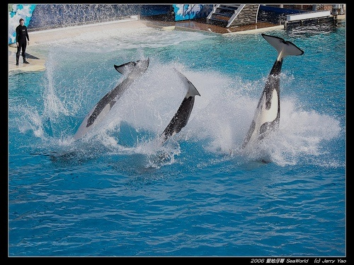
    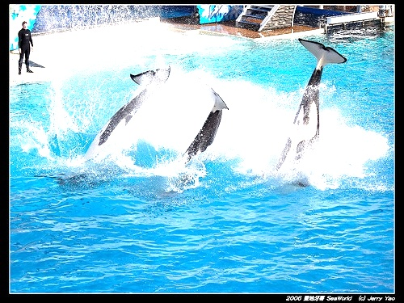
</div>

#### 🔵随机填充矩形遮挡
```python
fill_rectangles(rectangles_numer=(1, 5),area_range=(0.01, 0.1), method='random_intensity')
"""
rectangles_numer: 遮挡矩形的数量范围
area_range: 遮挡矩形的面积范围
method: 遮挡矩形的填充方式，目前支持'random_intensity' 'gaussian_noise' 'random_rgb'
"""
```
<div style="display: flex; justify-content: center; width: 100%;">
    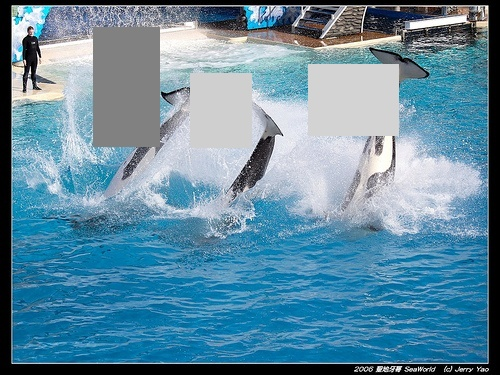
    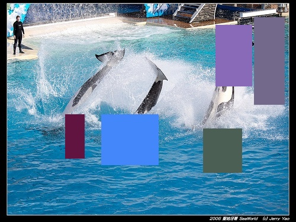
    
</div>

#### 🔵随机丢掉矩形区域
```python
coarse_dropout(dropout_ratio=(0.1, 0.5), size_percent=(0.01, 0.05), per_channel=0, random_state=None)
"""
dropout_ratio: 丢弃区域的比例
size_percent: 丢弃区域的大小
per_channel: 是否对每个通道单独处理
random_state: 随机状态,默认使用numpy的随机状态
"""
```
<div style="display: flex; justify-content: center; width: 100%;">
    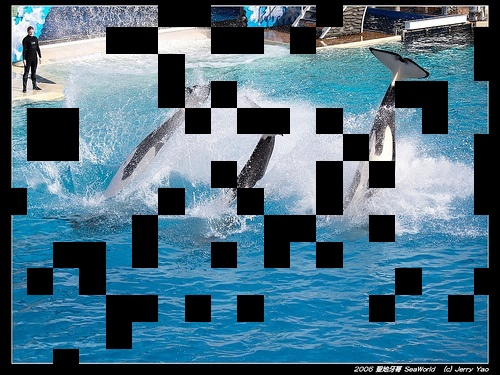
    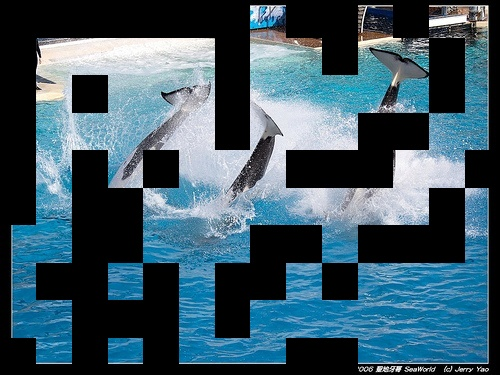
</div>

#### 🔵高斯模糊
```python
gaussian_blur(kernel_size=5, sigma_range=(0.0, 3), p=1)
"""
kernel_size: 模糊核大小
sigma_range: 高斯分布的标准差范围
p: 模糊概率
"""
```
<div style="display: flex; justify-content: center; width: 100%;">
    
    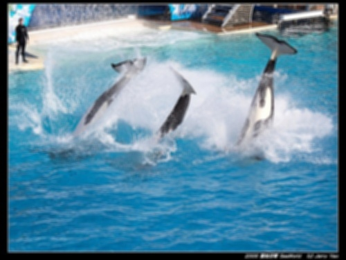
</div>

#### 🔵双边模糊
```python
bilateral_blur(d_range=(3, 10), sigma_color_range=(10, 250), sigma_space_range=(10, 250))
"""
d_range: 滤波器直径范围
sigma_color_range: 颜色空间的标准差范围
sigma_space_range: 坐标空间的标准差范围
"""
```
<div style="display: flex; justify-content: center; width: 100%;">
    
    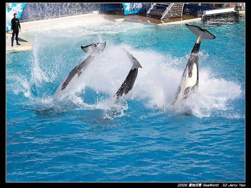
</div>

#### 🔵运动模糊
```python
motion_blur(k=15, angle_range=(-45, 45), p=1)
"""
k: 模糊核大小
angle_range: 运动方向角度范围
p: 模糊概率
"""
```
<div style="display: flex; justify-content: center; width: 100%;">
    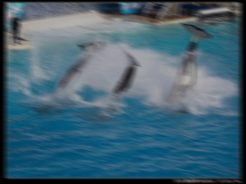
    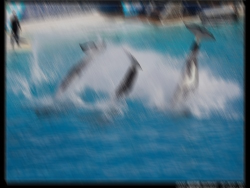
</div>

#### 🔵hsv空间变换
```python
hsv_transform(hue_shift=30, sat_scale=0.5, val_scale=0.5)
"""
hue_shift: 色调变换范围
sat_scale: 饱和度变换范围
val_scale: 明度变换范围
"""
```
<div style="display: flex; justify-content: center; width: 100%;">
    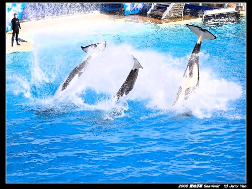
    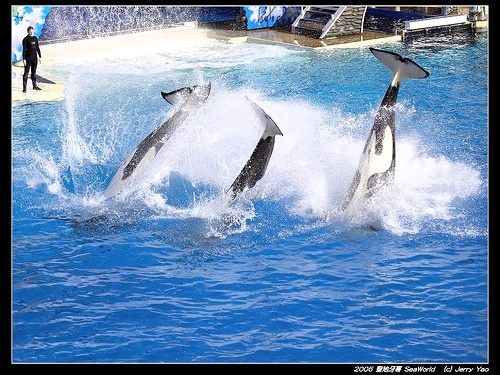
</div>

#### 🔵多色调和饱和度
```python
multiply_hue_and_saturation(hue_range=(0.5, 1.5), saturation_range=(0.5, 1.5))
"""
hue_range: 色调变换范围
saturation_range: 饱和度变换范围
"""
```
<div style="display: flex; justify-content: center; width: 100%;">
    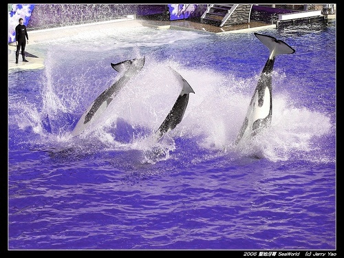
    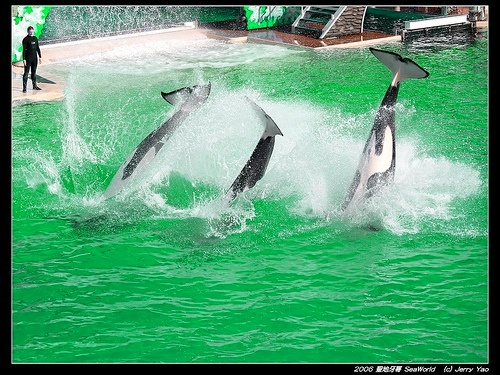
</div>

#### 🔵随机对比度变换
```python
sigmoid_contrast(gain_range=(3, 10), cutoff_range=(0.4, 0.6), per_channel=False)
"""
gain_range: 增益范围
cutoff_range: 截断范围
per_channel: 是否对每个通道单独处理
"""
```
<div style="display: flex; justify-content: center; width: 100%;">
    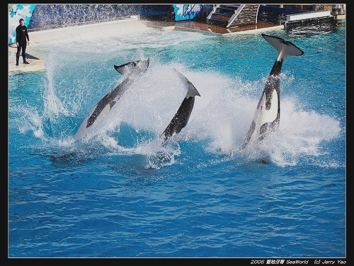
    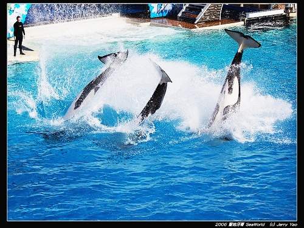
</div>

#### 🔵多种随机变换
```python
# 雾
apply_fog(severity=1, seed=None)
# 霜
apply_frost(severity=1, seed=None)
# 雪
apply_snow(severity=1, seed=None)
# 飞溅
apply_spatter(severity=1, seed=None)
# 对比度
apply_contrast(severity=1, seed=None)
# 饱和度
apply_saturate(severity=1, seed=None)
# 压缩分辨率
apply_jpeg_compression(severity=1, seed=None)
# 视频滤镜效果
apply_pixelate(severity=1, seed=None)
# 弹性变换
apply_elastic_transform(severity=1, seed=None)
"""
severity: 变换强度
seed: 随机种子
"""
```
<div style="display: flex; justify-content: center; width: 100%;">
    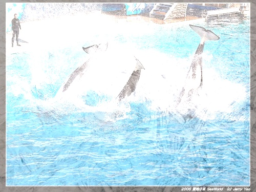
    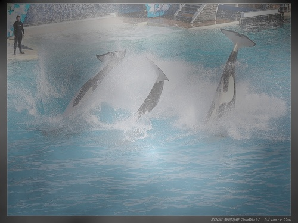
    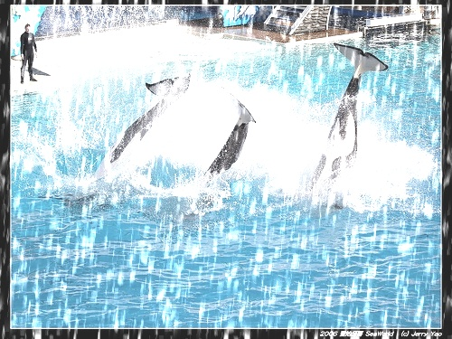
</div>
<div style="display: flex; justify-content: center; width: 100%;">
    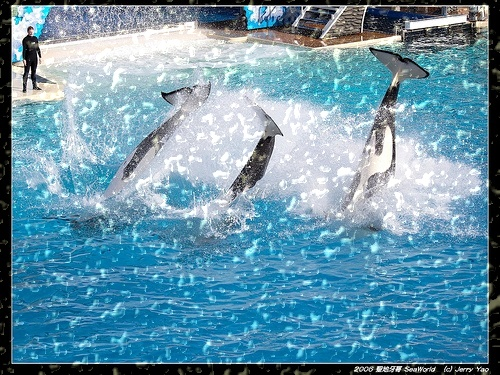
    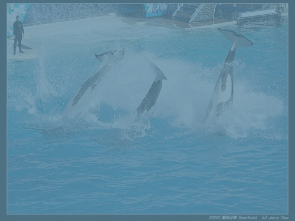
    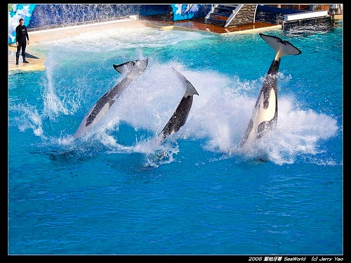
</div>
<div style="display: flex; justify-content: center; width: 100%;">
    
    
    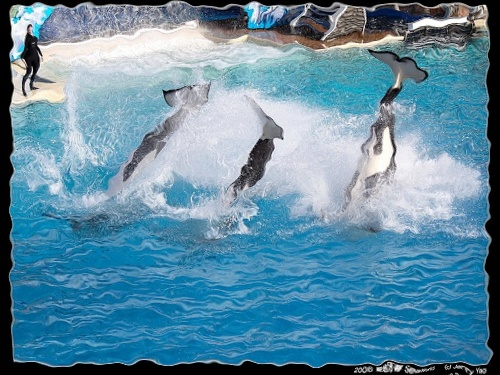
</div>